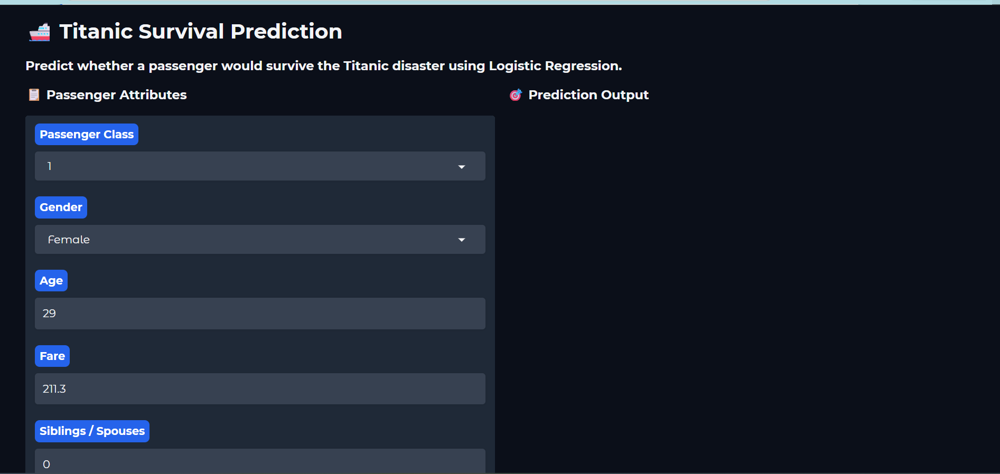
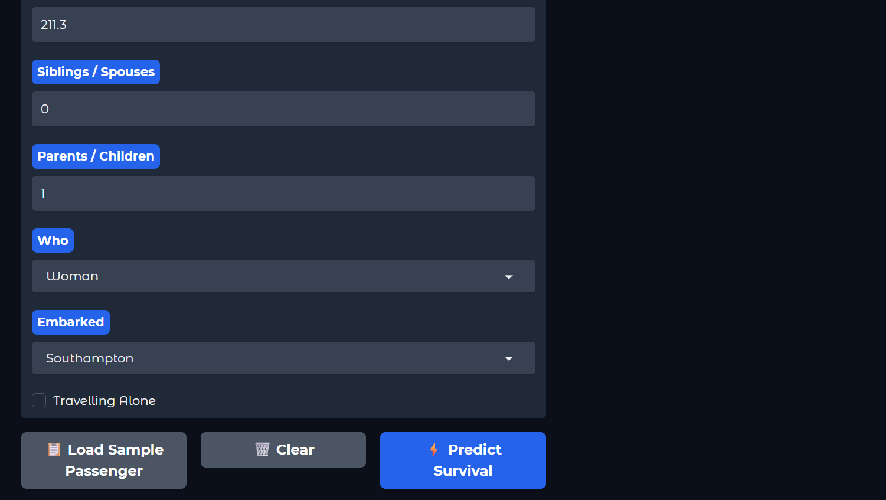
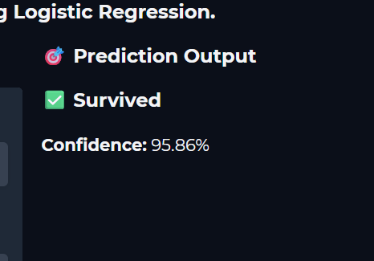

# 🚢 Titanic Survival Prediction

An end-to-end Machine Learning project that predicts whether a passenger would survive the Titanic disaster using **Logistic Regression**. The project includes data preprocessing, exploratory data analysis (EDA), model training, evaluation, and deployment using **Gradio**.

---

## 📌 Project Overview

The Titanic disaster is one of the most well-known shipwrecks in history. This project uses passenger information such as age, gender, passenger class, fare, and family details to predict survival outcomes.

The goal is to build a classification model that can accurately determine whether a passenger survived or not.

---

## 🎯 Problem Statement

Given passenger details, predict whether the passenger survived the Titanic disaster.

* **Target Variable:** Survived

  * 1 → Survived
  * 0 → Did Not Survive

---

## 📊 Dataset Features

The model was trained using the following features:

* Passenger Class (Pclass)
* Sex
* Age
* Fare
* Siblings/Spouses Aboard (SibSp)
* Parents/Children Aboard (Parch)
* Adult Male
* Alone
* Who (Man/Woman/Child)
* Embarked Port

---

## 🔍 Exploratory Data Analysis

The project includes:

* Missing Value Analysis
* Duplicate Value Check
* Summary Statistics
* Target Variable Distribution
* Feature Distribution Analysis
* Correlation Analysis
* Outlier Detection

---

## ⚙️ Machine Learning Workflow

1. Data Collection
2. Data Cleaning
3. Feature Engineering
4. Exploratory Data Analysis
5. Train-Test Split
6. Logistic Regression Model Training
7. Model Evaluation
8. Model Deployment

---

## 🤖 Model Used

* Logistic Regression

Evaluation Metrics:

* Accuracy Score
* Precision Score
* Recall Score
* F1 Score
* Confusion Matrix
* Classification Report

---

## 🖥️ Web Application

A simple and interactive web application was built using **Gradio**.

Features:

* Single Passenger Prediction
* Real-Time Prediction
* Survival Probability
* User-Friendly Interface
* Hugging Face Deployment Ready

---
## 📸 Application Screenshots

### 🏠 Home Page



### 📝 Passenger Input Form



### 🎯 Prediction Result



## 🛠️ Technologies Used

* Python
* Pandas
* NumPy
* Matplotlib
* Seaborn
* Scikit-Learn
* Gradio
* Joblib
* Hugging Face Spaces

---

## 📂 Project Structure

```text
Titanic-Survival-Prediction/
│
├── app.py
├── model.pkl
├── requirements.txt
├── TitanicServivalPrediction.ipynb
└── README.md
```

---

## 🚀 Installation

Clone the repository:

```bash
git clone https://github.com/your-username/titanic-survival-prediction.git
```

Move into the project directory:

```bash
cd titanic-survival-prediction
```

Install dependencies:

```bash
pip install -r requirements.txt
```

Run the application:

```bash
python app.py
```

---

## 📈 Future Improvements

* Random Forest Classifier
* XGBoost Classifier
* Hyperparameter Tuning
* Model Comparison Dashboard
* Advanced UI Design

---

## 📝 Development Note

The machine learning workflow, data preprocessing, feature engineering, model training, evaluation, and deployment were implemented by me.

AI coding assistants were used to improve code readability, UI design, and documentation.

---

## 👨‍💻 Author

**Abhay Dwivedi**

Computer Science Engineering (Cyber Security)

Aspiring Data Scientist & Machine Learning Engineer
